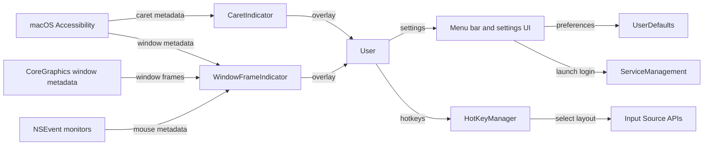

# LayoutLight Threat Model

## Executive summary

LayoutLight is a single-user local macOS menu-bar app whose meaningful security risk is not internet compromise, but local privacy and integrity around Accessibility access. The highest-value assets are user trust, the app's Accessibility-granted process, local settings, and the no-network/no-telemetry privacy invariant. Under the clarified scope, public release infrastructure and developer-machine supply-chain threats are out of scope; local self-signed/self-built usage is in scope.

## Scope and assumptions

In-scope paths:
- `LayoutLight/`
- `LayoutLightTests/`
- `LayoutLight.xcodeproj/project.pbxproj`
- `SECURITY.md`
- `README.md`

Out of scope:
- Public GitHub release operations and release-machine supply-chain threats.
- CI/CD compromise scenarios.
- Malicious Apple frameworks, compromised macOS, or a local attacker with root privileges.
- Network attackers, because the runtime app has no discovered network client/listener surface.

Explicit assumptions:
- The app is used by the developer as a local macOS utility and locally signed/self-built.
- Accessibility-derived caret and focused-window geometry are treated as low-sensitivity privacy metadata: they are not text content, but they can reveal which app/window is active and where typing is occurring.
- The intended privacy invariant is: do not read user text, do not persist observed UI/mouse metadata, and do not transmit telemetry.
- The app is intentionally not sandboxed because it relies on macOS Accessibility APIs. Evidence: `LayoutLight/LayoutLight.entitlements:5`, `SECURITY.md:11`.

Open questions that would materially change ranking:
- If LayoutLight becomes a public binary distributed to many users, release signing/notarization controls should be promoted back into the primary threat model.
- If networking, analytics, remote update, plugin loading, or helper tools are added, this model must be revised.

## System model

### Primary components

- Menu-bar application shell: `LayoutLight/LayoutLightApp.swift` initializes `MenuBarExtra`, app delegate state, settings callbacks, hotkeys, input-source observer, caret indicator, and window frame indicator.
- Caret indicator: `LayoutLight/CaretIndicator.swift` uses Accessibility APIs to follow focused text elements and draw a non-interactive overlay near the caret.
- Window frame indicator: `LayoutLight/WindowFrameIndicator.swift` and `LayoutLight/WindowIndicator/WindowFrameGeometry.swift` use Accessibility and CoreGraphics window metadata to draw an overlay around the focused window or edge.
- Hotkey manager: `LayoutLight/HotKeyManager.swift` registers Carbon global hotkeys and switches keyboard input sources.
- Settings stores: `LayoutLight/SettingsStores/*` persist non-secret local preferences in `UserDefaults`.
- Launch-at-login store: `LayoutLight/LaunchAtLoginSettings.swift` uses `SMAppService.mainApp` for optional local startup.

### Data flows and trust boundaries

- User -> Settings UI -> UserDefaults:
  - Data: colors, shape sizes, language indicator options, shortcuts, launch-at-login choice.
  - Channel/protocol: local UI events and `UserDefaults`.
  - Security guarantees: same-user local preference storage; no auth boundary inside the app.
  - Validation: some numeric settings are normalized, for example caret dimensions and delay in `LayoutLight/SettingsModels/CaretIndicatorSettings.swift`; color payloads are not clamped in `LayoutLight/SettingsModels/ColorRGBA.swift`.

- macOS Accessibility -> CaretIndicator:
  - Data: focused app PID, focused UI element, selected range metadata, bounds for caret/text-marker ranges.
  - Channel/protocol: macOS Accessibility API.
  - Security guarantees: gated by user-granted Accessibility permission via `AXIsProcessTrustedWithOptions`.
  - Validation: type checks for `AXValue`/`AXUIElement` and geometry sanity checks, e.g. `LayoutLight/CaretIndicator.swift:70`, `LayoutLight/CaretIndicator.swift:784`.

- macOS Accessibility/CoreGraphics -> WindowFrameIndicator:
  - Data: focused window element, window position/size, window number, mouse movement/click/drag metadata.
  - Channel/protocol: Accessibility API, CoreGraphics window list, `NSEvent` local/global monitors.
  - Security guarantees: Accessibility permission for AX data; no persistence/transmission per documented privacy posture.
  - Validation: minimum window size filtering in `LayoutLight/WindowIndicator/WindowFrameGeometry.swift:139`.

- Global hotkey events -> HotKeyManager -> TIS input source APIs:
  - Data: registered hotkey identifiers and selected input source IDs.
  - Channel/protocol: Carbon Event Manager and Text Input Source APIs.
  - Security guarantees: app-local handler for explicitly registered hotkeys.
  - Validation: shortcut keycodes are allowlisted/validated in `LayoutLight/HotKeySettings.swift:16`.

- App -> macOS ServiceManagement:
  - Data: launch-at-login registration state.
  - Channel/protocol: `SMAppService.mainApp`.
  - Security guarantees: macOS Service Management controls and same-user app registration.
  - Validation: error status is surfaced as localized UI text in `LayoutLight/LaunchAtLoginSettings.swift:31`.

#### Diagram

## Assets and security objectives

| Asset | Why it matters | Security objective (C/I/A) |
|---|---|---|
| Accessibility-granted app process | The app can observe UI geometry in other apps after user consent. | C/I |
| Caret/window/mouse metadata | Not text content, but can reveal active app/window and typing context. | C |
| User trust/privacy invariant | The app explicitly promises no networking, analytics, text capture, or telemetry. | C/I |
| Local settings in `UserDefaults` | Settings control overlays, hotkeys, colors, and behavior. | I/A |
| Hotkey registration and input source switching | Incorrect hotkey behavior can disrupt typing workflow. | I/A |
| Launch-at-login registration | Controls whether the app starts automatically for the user. | I |
| Source code and local build artifact | Local signing/self-build depends on source integrity. | I |

## Attacker model

### Capabilities

- Same-user local process can modify that user's preferences or interact with normal macOS user-level state.
- Local app can compete for global hotkeys or influence focus/window behavior.
- Malicious or unusual Accessibility clients can return malformed, stale, or extreme geometry through macOS APIs.
- Future maintainers can accidentally add APIs that violate the privacy invariant unless regression checks exist.

### Non-capabilities

- No remote network attacker is assumed because runtime networking is not present.
- No root, kernel, TCC database tampering, or compromised macOS is assumed.
- No public release pipeline compromise is included under the clarified scope.
- No cross-user or multi-tenant attacker is assumed; this is a single-user local utility.

## Entry points and attack surfaces

| Surface | How reached | Trust boundary | Notes | Evidence (repo path / symbol) |
|---|---|---|---|---|
| Accessibility permission prompt | User enables caret/window indicator | User/macOS TCC -> app | Gates access to focused UI/window geometry. | `LayoutLight/CaretIndicator.swift:218`, `LayoutLight/WindowFrameIndicator.swift:376` |
| Focused text element tracking | Frontmost app changes or AX notifications fire | Other app AX tree -> app | Reads selected range and bounds, not text content in current code. | `LayoutLight/CaretIndicator.swift:302`, `LayoutLight/CaretIndicator.swift:668`, `LayoutLight/CaretIndicator.swift:737` |
| Focused window geometry | Window indicator refreshes | Other app AX/CG metadata -> app | Reads window frame and filters small windows. | `LayoutLight/WindowIndicator/WindowFrameGeometry.swift:12`, `LayoutLight/WindowIndicator/WindowFrameGeometry.swift:139` |
| Global mouse event monitors | Window indicator enabled | macOS event system -> app | Observes movement/click/drag metadata for overlay refresh/suppression. | `LayoutLight/WindowFrameIndicator.swift:161` |
| Global hotkeys | User presses registered shortcuts | macOS event system -> app | Switches input source or shows overlay. | `LayoutLight/HotKeyManager.swift:25`, `LayoutLight/HotKeyManager.swift:63` |
| Local settings payloads | User or same-user process modifies defaults | UserDefaults -> app | Numeric settings are normalized; color components are now sanitized on init/decode. | `LayoutLight/SettingsStores/LanguageIndicatorSettingsStore.swift:13`, `LayoutLight/SettingsModels/ColorRGBA.swift:10` |
| Launch-at-login toggle | User toggles setting | App -> macOS ServiceManagement | Registers/unregisters main app. | `LayoutLight/LaunchAtLoginSettings.swift:31` |
| Logging/error sinks | AX/hotkey errors occur | Runtime state -> unified logging | Current logging uses privacy markers and avoids observed text. | `LayoutLight/CaretIndicator.swift:314`, `LayoutLight/HotKeyManager.swift:75` |

## Top abuse paths

1. Attacker goal: violate privacy invariant through a future code change.
   1. A maintainer adds `URLSession`, analytics, pasteboard reads, or AX text-value reads.
   2. The app already has Accessibility permission and user trust.
   3. Geometry or text-adjacent data is persisted or transmitted.
   4. Impact: privacy promise is broken.

2. Attacker goal: destabilize UI through malformed local settings.
   1. Same-user process writes malformed `UserDefaults` values.
   2. App decodes settings at launch.
   3. Non-finite/out-of-range color values reach `NSColor`/SwiftUI color construction.
   4. Impact: crash or broken overlays.

3. Attacker goal: confuse typing workflow through hotkey conflict.
   1. Another app registers the same global hotkey first.
   2. LayoutLight registration fails or shortcuts do not behave as expected.
   3. User expects language switching but receives inconsistent behavior.
   4. Impact: availability/usability degradation, not data compromise.

4. Attacker goal: force high-frequency refresh work through event/geometry churn.
   1. A local app rapidly changes focus/window geometry or drag state.
   2. Window indicator polls at drag cadence and refreshes overlays.
   3. Impact: localized CPU/UI churn while enabled.

5. Attacker goal: exploit excessive Accessibility scope if future features expand.
   1. The app remains non-sandboxed and Accessibility-trusted.
   2. A future feature starts reading broader AX attributes than geometry.
   3. Impact: confidentiality risk rises beyond the current low-sensitivity metadata model.

## Threat model table

| Threat ID | Threat source | Prerequisites | Threat action | Impact | Impacted assets | Existing controls (evidence) | Gaps | Recommended mitigations | Detection ideas | Likelihood | Impact severity | Priority |
|---|---|---|---|---|---|---|---|---|---|---|---|---|
| TM-001 | Future code change or malicious local modification | App keeps Accessibility permission; future code reads or sends more than geometry. | Read text-like AX values, pasteboard, or network-send observed metadata. | Privacy invariant violation and user trust loss. | Accessibility-granted process, privacy invariant, UI metadata | Current README/SECURITY promise no networking/telemetry (`SECURITY.md:3`, `SECURITY.md:7`); no runtime networking found; current caret code reads ranges/bounds (`LayoutLight/CaretIndicator.swift:668`, `LayoutLight/CaretIndicator.swift:737`); `scripts/privacy_api_check.sh` now scans runtime code for forbidden privacy-sensitive APIs. | The script is manual unless wired into CI or a release checklist. | Run `scripts/privacy_api_check.sh` before releases or commits touching runtime code; wire into CI if CI returns to scope. | Privacy check script output; future release checklist item for no-network/no-text-capture review. | Medium | Medium | Medium |
| TM-002 | Same-user local process | Attacker can write same user's `UserDefaults`. | Persist malformed settings, especially color components. | App crash, broken UI, or overlay rendering failure. | Local settings, availability | Caret dimensions/delay normalized (`LayoutLight/SettingsModels/CaretIndicatorSettings.swift`); hotkey keycodes validated (`LayoutLight/HotKeySettings.swift:16`); `ColorRGBA` now clamps finite values and replaces non-finite values (`LayoutLight/SettingsModels/ColorRGBA.swift:10`). | Residual risk is limited to same-user tampering with other settings payloads. | Keep normalization close to each decoded settings model; add malformed-payload tests when new settings are introduced. | Unit tests for malformed settings; crash reports if available locally. | Low | Low | Low |
| TM-003 | Other local app | Other app can register overlapping hotkeys or create focus churn. | Cause LayoutLight hotkey registration failures or inconsistent shortcut behavior. | Reduced availability/usability for language switching. | Hotkey behavior, input-source switching availability | Registration errors are detected and posted (`LayoutLight/HotKeyManager.swift:63`, `LayoutLight/HotKeyManager.swift:75`); shortcuts validate keycodes (`LayoutLight/HotKeySettings.swift:16`). | No security issue if reported clearly; mostly UX. | Keep visible settings warning for conflicts; preserve ability to rebind shortcuts. | Local logs for `hotKeyRegistrationFailed`; UI error state. | Medium | Low | Low |
| TM-004 | Malformed/stale AX providers or unusual apps | Accessibility APIs return stale elements, odd roles, or extreme geometry. | Trigger repeated refresh failures, hidden overlays, or layout churn. | Availability/usability degradation; possible CPU churn while enabled. | Overlay availability, app responsiveness | Type checks and stale element handling (`LayoutLight/CaretIndicator.swift:70`, `LayoutLight/CaretIndicator.swift:642`); window minimum size check (`LayoutLight/WindowIndicator/WindowFrameGeometry.swift:139`). | Geometry bounds are checked for finite/positive height, but not all coordinates are bounded to reasonable screen limits. | Clamp/sanity-check overlay frames to visible screens; keep polling intervals conservative; avoid storing AX-derived data. | Debug logs for repeated AX failures; local performance observation. | Low | Low | Low |
| TM-005 | User or same-user process | Launch-at-login setting is changed or registration fails. | Register/unregister startup unexpectedly or fail to reflect state accurately. | Startup behavior integrity issue, not data compromise. | Launch-at-login state | Uses `SMAppService.mainApp` and catches errors (`LayoutLight/LaunchAtLoginSettings.swift:31`). | No audit trail beyond UI status. | Keep status text explicit; avoid silent retry loops. | Local UI status and macOS Login Items state. | Low | Low | Low |

## Criticality calibration

Critical for this repo:
- A pre-auth remote code execution path. Not applicable under current no-network local utility model.
- Silent capture and exfiltration of user text or credentials through Accessibility. Not present in current code.
- A stealth auto-update/plugin path executing untrusted code. Not present.

High for this repo:
- Any runtime networking or telemetry added while Accessibility access remains enabled.
- Reading selected text, password fields, pasteboard contents, or browser content instead of geometry.
- Launching subprocesses or loading unsigned plugins from user-writable paths.

Medium for this repo:
- Regression that stores caret/window/mouse metadata locally without clear need.
- Significant local DoS caused by malformed Accessibility geometry or settings.
- Release/distribution hardening gaps if public distribution becomes in scope.

Low for this repo:
- Same-user local preference tampering that only breaks overlays.
- Hotkey conflicts with other local apps.
- Cosmetic overlay misplacement from unusual apps or stale AX elements.

## Focus paths for security review

| Path | Why it matters | Related Threat IDs |
|---|---|---|
| `LayoutLight/CaretIndicator.swift` | Core Accessibility boundary for caret metadata; must remain geometry-only. | TM-001, TM-004 |
| `LayoutLight/WindowFrameIndicator.swift` | Uses global mouse monitors and AX window observers. | TM-001, TM-004 |
| `LayoutLight/WindowIndicator/WindowFrameGeometry.swift` | Converts AX/CG window metadata into overlay frames. | TM-004 |
| `LayoutLight/HotKeyManager.swift` | Global hotkey event handling and input-source switching. | TM-003 |
| `LayoutLight/HotKeySettings.swift` | Shortcut validation and persisted hotkey settings. | TM-002, TM-003 |
| `LayoutLight/SettingsModels/ColorRGBA.swift` | Decodes color values that should be finite and clamped. | TM-002 |
| `LayoutLight/SettingsStores/` | UserDefaults persistence boundary for local settings. | TM-002 |
| `LayoutLight/LaunchAtLoginSettings.swift` | Local startup registration boundary. | TM-005 |
| `SECURITY.md` | Defines privacy and non-sandboxing claims that code should keep satisfying. | TM-001 |
| `LayoutLight.xcodeproj/project.pbxproj` | Build settings for Hardened Runtime and entitlements; secondary under local-signing scope. | TM-001 |

## Quality check

- Covered all discovered runtime entry points: Accessibility prompts/observers, global mouse monitors, global hotkeys, settings persistence, launch-at-login.
- Each trust boundary is represented in at least one threat: AX metadata, event system, UserDefaults, ServiceManagement, and local build/source integrity.
- Runtime behavior is separated from release/CI/dev tooling; public release infrastructure is explicitly out of scope per user clarification.
- User clarifications reflected: local signing/self-build only, release-machine threats excluded, Accessibility geometry treated as low-sensitivity privacy metadata with no-telemetry invariant.
- Assumptions and open questions are explicit.
